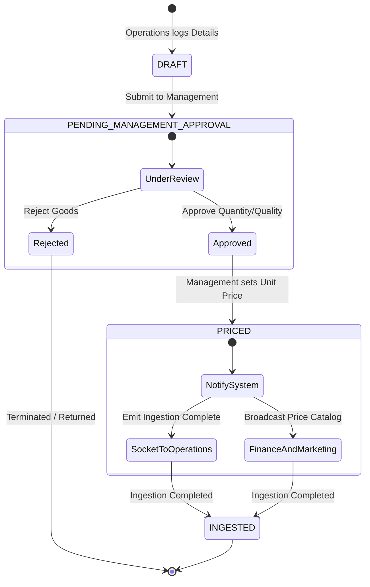
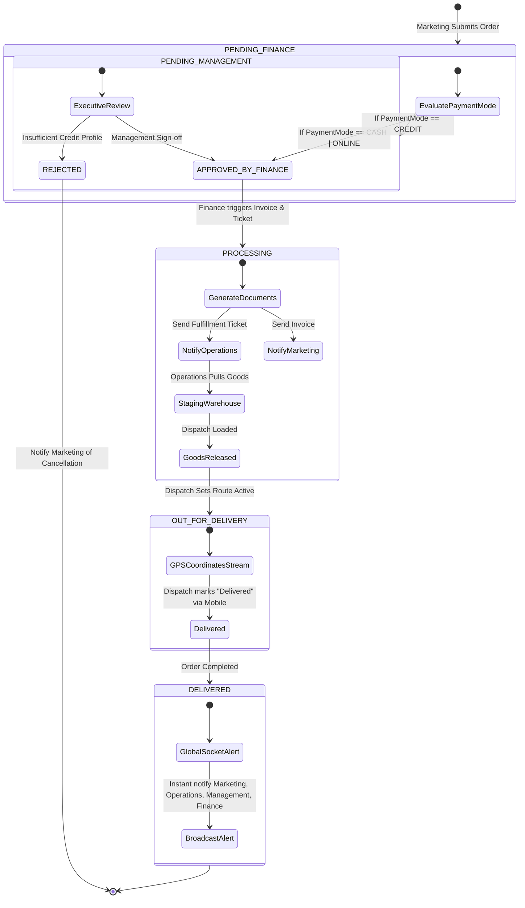

# Rebma Impex ERP - Core Workflows & State Machines

This document outlines the state transitions and notification logs for the main workflows of Rebma Impex Limited.

---

## Workflow A: Port Inventory Intake & Pricing

Operations handles incoming shipments from ports and logs ingestion entries. These records are placed in a holding state until Management inspects, approves, and sets wholesale/retail pricing.

### Workflow Diagram

### State Transitions Table

| Current State | Action/Trigger | Roles Involved | Next State | System Actions |
| :--- | :--- | :--- | :--- | :--- |
| **`None`** | Log incoming goods details | `OPERATIONS` | `DRAFT` | Operations logs company, weight, country, discrepancies. |
| **`DRAFT`** | Submit logs to Management | `OPERATIONS` | `PENDING_MANAGEMENT_APPROVAL` | Adds database record. Sends alert to Management dashboards. |
| **`PENDING_MANAGEMENT_APPROVAL`** | Review and Approve quantities | `MANAGEMENT` | `APPROVED` | Updates status. Operations dashboard is updated with approval confirmation. |
| **`PENDING_MANAGEMENT_APPROVAL`** | Reject discrepancies/faulty goods | `MANAGEMENT` | `REJECTED` | Sends alert back to Operations. Ingestion terminates. |
| **`APPROVED`** | Pricing input & sign-off | `MANAGEMENT` | `PRICED` | System saves `unitPrice`. Broadcasts socket notification to Operations. |
| **`PRICED`** | System broadcasts ingestion updates | `SYSTEM` | `INGESTED` | Socket event emits "Ingestion Complete" to Operations. Broadcasts pricing changes to Finance & Marketing. |

---

## Workflow B: Order Processing & Dispatch Delivery

Marketing client orders are evaluated for credit status. Standard cash/online orders bypass Management review, while credit requests route strictly to Management for sign-off.

### Workflow Diagram

### State Transitions Table

| Current State | Action/Trigger | Roles Involved | Next State | System Actions |
| :--- | :--- | :--- | :--- | :--- |
| **`None`** | Marketing submits new client order | `MARKETING` | `PENDING_FINANCE` | Order logged. Status initialized. Notification sent to Finance ledger queues. |
| **`PENDING_FINANCE`** | Order payment mode is Credit | `FINANCE` | `PENDING_MANAGEMENT` | Order is flagged and routed to Management dashboard approvals queue. |
| **`PENDING_FINANCE`** | Order is Cash / Online | `FINANCE` | `APPROVED` | Finance processes directly. Status updated, triggering generation engine. |
| **`PENDING_MANAGEMENT`** | Management approves credit risk | `MANAGEMENT` | `APPROVED` | Updates status, routes back to Finance for execution. |
| **`PENDING_MANAGEMENT`** | Credit review rejected | `MANAGEMENT` | `REJECTED` | Cancels order. Emails Marketing user with reasons. |
| **`APPROVED`** | Documents generated | `SYSTEM` | `PROCESSING` | System generates Invoice (notifies Marketing) and warehouse Fulfillment Ticket (notifies Operations). |
| **`PROCESSING`** | Goods are packaged and released | `OPERATIONS` | `OUT_FOR_DELIVERY` | Warehouse releases items. Dispatcher claims the load. Active GPS stream begins. |
| **`OUT_FOR_DELIVERY`** | Driver marks order as delivered | `DISPATCH` (Mobile) | `DELIVERED` | Location stream stops. Timestamps logged. Instant global WebSocket alert broadcast to Marketing, Operations, Management, Finance. |
