# 📱 Rebma Impex Mobile — Aczone Design System & Architecture Specification (`mobileUI.md`)

This document defines the complete UI/UX overhaul of **Rebma Impex Mobile**, transitioning the visual language and layout architecture to the **Aczone Design System**.

**Every number in this document is verified directly against the live codebase, not recalled or estimated.** The "Verified" sections below were re-counted by listing real files and cross-checking every import — zero guessing. This document is updated every time a piece's design is agreed and built: the piece gets its own entry in the **Design Decisions Log** at the bottom, in the order it was done.

*Last verified: 2026-09-18 — screen count corrected from a stale 124 to the real, confirmed 134.*

---

## 🗺️ Visual Architecture & Flowchart

```mermaid
flowchart TB
    subgraph DesignSystem ["🎨 Aczone Foundation Layer"]
        Tokens["Theme Tokens (Violet #5B4DFF, Lavender #F8F7FD, Pill Radii, Soft Ambient Shadows)"]
        AppearanceEngine["Customization Engine (Background Palettes & Button Accent Swatches)"]
        UIPrimitives["Aczone UI Kit — 44 components (23 primitives, 15 data-aware, 6 chrome)"]
    end

    subgraph NavigationLayer ["🧭 Navigation & Chrome"]
        AppHeader["Aczone Header v2 (Logo pill, department label, Chat/Bell/Avatar, collapsible greeting + search pill)"]
        AppTabBar["Bottom Tab Bar (Home, Viber, Quick Action [+], Analytics, Profile)"]
        ModuleLauncher["Aczone Module Grid (Icon Tiles, Item Counts, Fast Switcher)"]
        QuickActions["Interactive Action Sheets (Modal Grid with Pastel Circles)"]
    end

    subgraph Departments ["🏢 134 Screens Total"]
        CEO["👑 CEO Command (14 dept screens + 1 Analytics-tab screen)"]
        Warehouse["🚢 Admin & Warehouse (12 dept screens)"]
        Finance["💰 Accounts Department (20 dept screens + 1 Analytics-tab screen)"]
        Risk["🛡️ Risk & Compliance (12 dept screens, incl. Dispatch + 1 Analytics-tab screen)"]
        Management["📊 Management (14 dept screens)"]
        Marketing["📈 Marketing & Sales (7 dept screens)"]
        HR["👥 Human Resources (10 dept screens + 1 Analytics-tab screen)"]
        Production["⚙️ Production (6 dept screens)"]
        Reception["🏢 Reception (6 dept screens)"]
        Boardroom["🎥 Boardroom (4 dept screens)"]
        Settings["⚙️ Settings (6 dept screens)"]
        RootAuth["🌐 Root, Auth & Shell (15 screens)"]
        DriverOnly["🚚 Driver-only (2 screens, department-agnostic)"]
    end

    DesignSystem --> NavigationLayer
    NavigationLayer --> Departments
```

---

## ✅ Verified: Total Screen Count — 134

Counted by listing every `.tsx` file under `screens/` (134 files), then confirming every one of them has at least one real importer somewhere in `navigation/`, `screens/`, or `components/` — **zero dead files, zero orphans**. The 134 splits into four groups, which is why a naive "sum of each department's registered sub-tabs" undercounts it:

| Group | Count | What it is |
|---|---|---|
| Registered department screens | **111** | Every screen imported directly into a department's `screens` map in `navigation/departmentRegistry.ts` — reachable from that department's Module Launcher. Some of these are thin re-export files pointing at a shared canonical screen (see below). |
| Root, Auth & Shell screens | **15** | Not department-scoped: `WelcomeScreen`, `LoginScreen`, `RegisterScreen`, `ProfileScreen`, `NotificationsScreen`, `FeedbackScreen`, `SearchScreen`, `PayslipsScreen`, `MessengerChannelsScreen`, `MessengerThreadScreen`, `DepartmentPlaceholderScreen`, `DesignSystemScreen`, `AnalyticsTabScreen`, `BoardroomHomeScreen`, `ViberHomeScreen`. |
| Cross-department Analytics-tab screens | **4** | `finance/FinAnalyticsScreen`, `hr/HrAnalyticsScreen`, `ceo/CeoAnalyticsScreen`, `risk/RiskAnalyticsScreen` — live inside their department's folder but are reached through the separate bottom-tab `AnalyticsTabScreen`, not through the department Module Launcher, so they don't appear in that department's registered count above. |
| Driver-only screens | **2** | `dispatch/DispatchHomeScreen`, `dispatch/DriverTripsScreen` — department-agnostic, reached by a driver account before any department shell renders. |
| Shared canonical screens (reused via re-export) | **2** | `marketing/InvoicesScreen` and `marketing/SalesHistoryScreen` are the real, single source files. `finance/InvoicesScreen`, `management/InvoicesScreen`, and `ceo/InvoicesScreen` are one-line re-exports of the first; `finance/SalesHistoryScreen` re-exports the second. Each re-export file is counted once in "Registered department screens" above; the two source files are counted here since they aren't directly registered under Marketing itself. |
| **Total** | **134** | |

### Registered screens per department (verified against `departmentRegistry.ts`'s actual `screens` map, not its sub-tab list)

| Department | Registered screens |
|---|---|
| Accounts Department (Finance) | **20** |
| CEO Command | **14** |
| Management | **14** |
| Admin & Warehouse | **12** |
| Risk & Compliance (incl. relocated Dispatch) | **12** |
| Human Resources | **10** |
| Marketing & Sales | **7** |
| Reception | **6** |
| Production | **6** |
| Settings | **6** |
| Boardroom | **4** |
| **Subtotal** | **111** |

Plus the 15 Root/Auth/Shell + 4 Analytics-tab + 2 driver-only + 2 shared-canonical screens above = **134**.

---

## ✅ Verified: Component Library — 44 components

Counted the same way — every file listed, no estimate:

| Layer | Count | Examples |
|---|---|---|
| `components/ui/` — prop-only primitives | **23** | Avatar, Badge, BarChart, Button, Card, CountUp, DataList, EmptyState, Input, MetricCard, PageTitle, ProgressBar, ProgressRing, RatingBadge, Screen, SearchablePicker, SectionHeader, Sheet, Skeleton, StatusCapsule, StickyActionBar, Tabs, Toggle |
| `components/shared/` — data-aware composite components | **15** | ApprovalHistoryPanel, DeptActivityGrid, DocumentTemplatesEditor, ExportSheet, FleetMap, GroupCallSheet, LocationPicker, NativeCallSheet, PendingApprovalsAlertCard, PerformanceAlertsPanel, PriceCatalogGrid, RequestTimelineSheet, SpreadsheetGrid, TransactionsGrid, WalletsGrid |
| `components/chrome/` — navigation shell | **6** | AppHeader, ConnectivityBanner, DepartmentSwitcherSheet, DriverQuickActionsSheet, ModuleLauncher, QuickActionsSheet |
| **Total** | **44** | |

---

## 🎨 1. Theme Tokens & Dynamic Customization

Confirmed against the live `theme/tokens.ts` — these are real, not aspirational.

### Brand Colors & Accent Matrix
* **Primary Brand:** Royal Violet (`#5B4DFF` → `accentPressed #4F46E5`) with soft lavender tinting (`bgPage #F8F7FD`). Confirmed exact match in `tokens.ts`.
* **Semantic Pastels Matrix** (confirmed, `tokens.ts`'s `status` object):
  * 🌿 **Mint / Emerald (`#DCFCE7` / `#10B981`):** success state.
  * 🌊 **Sky / Blue (`#E0F2FE` / `#0284C7`):** info state.
  * ⚡ **Amber / Gold (`#FEF3C7` / `#D97706`):** warning state.
  * 🌸 **Rose / Coral (`#FFE4E6` / `#E11D48`):** danger state.
  * 🔮 **Lavender / Purple (`#EDE9FE` / `#6C5CE7`):** purple/info-secondary state.
* **Fixed Action Icon Colors** (`tokens.ts`'s `action` object, used for icon tiles independent of theme): emerald `#10b981`, blue `#3b82f6`, indigo `#6366f1`, amber `#f59e0b`, teal `#14b8a6`, sky `#0ea5e9`, rose `#f43f5e`, violet `#5b4dff`.

### Dynamic Settings Engine
In **Settings > Display & Appearance (`AppearanceScreen.tsx`)** — not yet re-verified line by line against the live screen; carried over from the prior spec pending confirmation:
1. Background Palette Switcher (Lavender Soft / Clean Slate / Warm Linen / Pure Crisp White / Dark Mode)
2. Button & Accent Swatch Switcher (Royal Violet / Emerald Green / Ocean Blue / Sunset Amber / Rose Berry / Teal Cyan)
3. Typography & Font Scaling (Small 90% / Medium 100% / Large 115%)

---

## 🏢 2. Department Screen Breakdown (verified against `departmentRegistry.ts`)

1. **👑 CEO Command — 14 registered + 1 Analytics-tab (15):** Overview, SupplierOrders, Transactions, Invoices, Receipts, PriceCatalog, Wallets, Accounts, Approvals, PriceApprovals, Tracking, LiveUsers, DeptActivity, Spreadsheets — plus `CeoAnalyticsScreen` (Analytics tab).
2. **🚢 Admin & Warehouse — 12:** Overview, PortIngestion, ApprovedGoods, Stock, Releases, OpsHistory, FleetOverview, FuelManagement, Maintenance, FleetAnalytics, OpsAnalytics, Spreadsheets.
3. **💰 Accounts Department (Finance) — 20 registered + 1 Analytics-tab (21):** Evaluation (home), OrdersQueue, RecordPayment, Receipts, Invoices, SalesHistory, PriceCatalog, Wallets, Transactions, CreditMgmt, Cheques, MobileMoney, PettyCash, Expenses, Payroll, RecurringPayments, Statement, TaxVAT, FinReports, Spreadsheets — plus `FinAnalyticsScreen` (Analytics tab).
4. **🛡️ Risk & Compliance — 12 registered + 1 Analytics-tab (13):** RiskOverview (home), RiskApprovals, CustomerCredit, Recruitment, Deliveries, ActiveDeliveries, Drivers, Tracking, ProofOfDelivery, Scanner, DeptActivity, Spreadsheets — plus `RiskAnalyticsScreen` (Analytics tab). (Deliveries/ActiveDeliveries/Drivers/Tracking/ProofOfDelivery/Scanner physically live under `screens/adminWarehouse/` but are registered under Risk, per the Phase 9 dispatch-into-Risk move.)
5. **📊 Management — 14:** CargoApproval (home), CreditApproval, Transactions, SetPrices, Invoices, Receipts, Ledger, Payroll, MgmtAnalytics, StockManagement, Tracking, DeptActivity, PerformanceAlerts, Spreadsheets.
6. **📈 Marketing & Sales — 7:** Overview (home), CreateOrder, RegisterCustomer, PriceCatalog, CreditRequests, MktAnalytics, Spreadsheets. (Marketing also *owns* the source files for Invoices and Sales History, re-exported by Finance/Management/CEO — see the shared-canonical row above — but Marketing itself has no Invoices/SalesHistory tab.)
7. **👥 Human Resources — 10 registered + 1 Analytics-tab (11):** Employees (home), Staff, Attendance, Registrations, LeaveManagement, Payroll, DepartmentManager, PerformanceAlerts, HrQueries, Spreadsheets — plus `HrAnalyticsScreen` (Analytics tab).
8. **⚙️ Production — 6:** Requisition (home), InternalOrders, WIPStock, OutputRecording, ProdAnalytics, Spreadsheets.
9. **🏢 Reception — 6:** VisitorLog (home), Visitors, EmployeeCheckin, DailyReports, Analytics, Spreadsheets.
10. **🎥 Boardroom — 4:** VideoConf (home), Announcements, DirectMessages, Meetings.
11. **⚙️ Settings — 6:** Appearance (home), Profile, ChangePassword, TwoFactor, ControlCenter, DeleteAccount.
12. **🌐 Root, Auth & Shell — 15:** WelcomeScreen, LoginScreen, RegisterScreen, ProfileScreen, NotificationsScreen, FeedbackScreen, SearchScreen, PayslipsScreen, MessengerChannelsScreen, MessengerThreadScreen, DepartmentPlaceholderScreen, DesignSystemScreen, AnalyticsTabScreen, BoardroomHomeScreen, ViberHomeScreen.
13. **🚚 Driver-only — 2:** DispatchHomeScreen, DriverTripsScreen (department-agnostic; a driver account never sees a department shell).

---

## 🧩 3. Component Design Specifications

Carried over from the prior spec — matches the accent/status tokens confirmed above, but the per-component visual details (radii, shadows) have not yet been individually re-verified against each component file. Treat this table as design intent until each row gets its own confirmed log entry below.

| Component | Key Aczone Design Specifications |
| :--- | :--- |
| `Card.tsx` | Pure white (`#FFFFFF`), `borderRadius: 22`, micro-border (`#EDE9FE`), ambient soft violet drop-shadow (`rgba(91, 77, 255, 0.06)`). |
| `MetricCard.tsx` | 2x2 grid layout, `44x44` pastel icon container, bold `type.kpi28` counters, uppercase labels, touch ripple. |
| `DataList.tsx` (Tables) | Aczone Data Card pattern: leading colored icon tile, bold title + status pill, 2-column key-value spec grid, context actions. |
| `Button.tsx` | Full rounded pill (`borderRadius: 9999` or `16`), gradient fill, white bold label with trailing arrow icon (→). |
| `Input.tsx` & Pickers | Soft lavender background (`#F8F7FD`), `borderRadius: 16`, subtle border with focused violet glow (`#6C5CE7`). |
| `ProgressBar.tsx` | Rounded capsule progress tracks (8–12px), dual-color violet/cyan gradients, percentage labels. |
| `Tabs.tsx` | Horizontal slider of rounded pill chips with solid violet active fill and soft-lavender inactive pills. |
| `Sheet.tsx` (Modals) | Smooth animated bottom sheets with rounded grab bar, clean header with ✕ dismiss, padded action footers. |

---

## Design Decisions Log

Every entry below reflects the piece's **actual, current implementation** as read from source — not the intended/planned version. New entries are appended here, in build order, as each piece gets styled.

### 1. Header — `components/chrome/AppHeader.tsx` — ✅ rebuilt to match `DESIGN_DECISIONS.md`'s accepted spec

**Correction, 2026-09-18:** the previous version of this entry described "Aczone Header v2," an implementation that had drifted from the actually-accepted spec (real logo dropped for styled text, the ⋮ overflow icon missing, icons given accentSoft circle backdrops, and — the biggest miss — the header shrinking/fading on scroll, which is the exact behavior `DESIGN_DECISIONS.md` records as tried and explicitly rejected). That was a mistake: the current implementation was documented as if it were the agreed design without checking it against the real agreed spec first. Rebuilt from scratch against `rebma-mobile/DESIGN_DECISIONS.md`'s "ACCEPTED — Top Nav Bar" section, point for point:

- **Background:** solid purple gradient (`#5B4DFF` → `#4F46E5`, via `expo-linear-gradient`), full-bleed, rounded bottom corners (28px). Never a hard-edged rectangle.
- **Left:** the real company logo (`assets/logo.png`) in a small white circular chip, followed by a chevron-down — opens the Department Switcher.
- **Right, exact order:** Chat → Bell → Avatar → vertical ⋮ overflow, at the very far right, after the avatar. Bare icons, white, no circle backdrop.
- **Greeting block:** bold white "{greeting}, {first name} 👋", a green dot + "Active Session" label, then a separate department pill ("{Department} ▾").
- **Search bar:** one white pill — magnifying-glass icon, placeholder text, a thin vertical divider, then a filter/sliders icon inside the same input (not a separate button outside it).
- **No day/night toggle** — Settings → Appearance already has the real one.
- **Scroll behavior — rebuilt to the accepted 3-state design, not the shrink/fade version:** the header (purple background + greeting + search) is one fixed layer that never resizes or moves. A separate fixed icon-row layer sits in front of it, always reachable, with only Chat/Bell fading out past a small scroll threshold (reachable via the ⋮ menu). The actual screen content — rendered between those two fixed layers — starts with a transparent spacer exactly matching the header's real height, then an opaque, rounded-top white content sheet (`components/ui/Screen.tsx`'s new dashboard mode, auto-enabled whenever a screen passes `onScroll` from `useCollapsibleHeader()`). Because that spacer-then-sheet is just normal scrollable content sitting behind the header at rest, scrolling the page is what makes the sheet rise and cover the header — no transform/animation needed for the covering effect itself. The sheet's own top-corner radius (20px) is deliberately smaller than the header's bottom-corner radius (28px), producing the corner-peek effect described in the spec.
- **Where each piece lives now:** `AppHeader.tsx` exports two components — `DashboardHeaderBackground` (the fixed purple layer) and `DashboardIconRow` (the fixed icon layer) — both rendered once inside `navigation/DepartmentHomeScreen.tsx`, not as a permanent `AppShell`-level sibling. That's what stops it from double-stacking above a pushed sub-tab screen's own `SubScreenHeader`: native-stack shows one full, opaque screen at a time, so a header living inside the `DepartmentHome` route naturally disappears the moment something is pushed on top of it.

**Verified:** `tsc --noEmit` clean, `expo export --platform ios` bundles clean (logo asset confirmed bundled), `store/deliveryStore.ts` zero diff. **Not yet verified:** actual on-device rendering — this machine has no full Xcode install, so the iOS Simulator tool isn't available here, and this was pushed for the user to check on their own phone via their already-running Expo Go session rather than claimed as visually confirmed.

### 2. Sub-screen headers (every pushed screen app-wide) — `components/chrome/SubScreenHeader.tsx` — ✅ current

Headers for individual pages aren't defined per-screen file — they're centralized in each stack navigator's `screenOptions`. Before this entry, every stack used React Navigation's plain default header, just tinted with our colors (`headerStyle`/`headerTitleStyle`/`headerTintColor`), with no custom shape — and two stacks (`ProfileStackScreen`, `DriverProfileStack`) had no theming applied at all, using the raw system default. Two of those five stacks (`ViberStack.tsx`, `DriverProfileStack.tsx`) also turned out to be untracked files, never `git add`-ed in the first place.

Built one shared `SubScreenHeader` component matching `AppHeader.tsx`'s own visual language, and wired it into all five native-stack navigators that push sub-screens app-wide:

- **Back button:** the exact same 36×36 `accentSoft`-tinted circular chip `AppHeader.tsx` already uses for its Chat/Bell buttons — a chevron-left icon in `accent` color, not the plain system chevron.
- **Title:** bold, `textPrimary`, `type.base16` — same as before, just centralized into one component instead of repeated per-navigator.
- **Bar:** `bgHeader` background, safe-area-aware top padding, a hairline `border`-colored bottom line (no drop shadow) — matching `AppHeader.tsx`'s own border-bottom treatment.
- **Right slot:** honors each screen's own `headerRight` option when it sets one (e.g. Messenger thread actions); otherwise a blank spacer keeps the title centered.

Wired into: `AppShell.tsx`'s `DepartmentStackScreen` (every department sub-tab — ~100 screens) and `ProfileStackScreen` (Design System / Feedback / Payslips), `MessengerStack.tsx` (Messenger thread), `ViberStack.tsx` (Boardroom + its 4 screens, Messenger thread reached from Chats), and `DriverProfileStack.tsx` (the driver's own Design System / Feedback / Payslips). Department **home/dashboard** screens are unaffected — those still render the full `AppHeader` (greeting, search, department switcher), which is a deliberately different, dashboard-only header, not a sub-page one.

Verified: `npx tsc --noEmit` clean, `npx expo export --platform ios` bundles clean (3407 modules), `store/deliveryStore.ts` shows zero diff (driver GPS flow untouched).

*(Next entries get appended here as each further piece is confirmed and styled.)*
