# 📱 Rebma Impex Mobile — Aczone Design System & Architecture Specification (`mobileUI.md`)

This document defines the complete UI/UX overhaul of **Rebma Impex Mobile**, transitioning the visual language and layout architecture to the **Aczone Design System**.

**Every number in this document is verified directly against the live codebase, not recalled or estimated.** The "Verified" sections below were re-counted by listing real files and cross-checking every import — zero guessing. This document is updated every time a piece's design is agreed and built: the piece gets its own entry in the **Design Decisions Log** at the bottom, in the order it was done.

*Last verified: 2026-09-18 — screen count corrected from a stale 124 to the real, confirmed 134.*

---

## 🗺️ Visual Architecture & Flowchart

```mermaid
flowchart TB
    subgraph DesignSystem ["🎨 Aczone Foundation Layer"]
        Tokens["Theme Tokens (Violet #5B4DFF, Lavender #F8F7FD, Pill Radii, Soft Ambient Shadows)"]
        AppearanceEngine["Customization Engine (Background Palettes & Button Accent Swatches)"]
        UIPrimitives["Aczone UI Kit — 44 components (23 primitives, 15 data-aware, 6 chrome)"]
    end

    subgraph NavigationLayer ["🧭 Navigation & Chrome"]
        AppHeader["Aczone Header v2 (Logo pill, department label, Chat/Bell/Avatar, collapsible greeting + search pill)"]
        AppTabBar["Bottom Tab Bar (Home, Viber, Quick Action [+], Analytics, Profile)"]
        ModuleLauncher["Aczone Module Grid (Icon Tiles, Item Counts, Fast Switcher)"]
        QuickActions["Interactive Action Sheets (Modal Grid with Pastel Circles)"]
    end

    subgraph Departments ["🏢 134 Screens Total"]
        CEO["👑 CEO Command (14 dept screens + 1 Analytics-tab screen)"]
        Warehouse["🚢 Admin & Warehouse (12 dept screens)"]
        Finance["💰 Accounts Department (20 dept screens + 1 Analytics-tab screen)"]
        Risk["🛡️ Risk & Compliance (12 dept screens, incl. Dispatch + 1 Analytics-tab screen)"]
        Management["📊 Management (14 dept screens)"]
        Marketing["📈 Marketing & Sales (7 dept screens)"]
        HR["👥 Human Resources (10 dept screens + 1 Analytics-tab screen)"]
        Production["⚙️ Production (6 dept screens)"]
        Reception["🏢 Reception (6 dept screens)"]
        Boardroom["🎥 Boardroom (4 dept screens)"]
        Settings["⚙️ Settings (6 dept screens)"]
        RootAuth["🌐 Root, Auth & Shell (15 screens)"]
        DriverOnly["🚚 Driver-only (2 screens, department-agnostic)"]
    end

    DesignSystem --> NavigationLayer
    NavigationLayer --> Departments
```

---

## ✅ Verified: Total Screen Count — 134

Counted by listing every `.tsx` file under `screens/` (134 files), then confirming every one of them has at least one real importer somewhere in `navigation/`, `screens/`, or `components/` — **zero dead files, zero orphans**. The 134 splits into four groups, which is why a naive "sum of each department's registered sub-tabs" undercounts it:

| Group | Count | What it is |
|---|---|---|
| Registered department screens | **111** | Every screen imported directly into a department's `screens` map in `navigation/departmentRegistry.ts` — reachable from that department's Module Launcher. Some of these are thin re-export files pointing at a shared canonical screen (see below). |
| Root, Auth & Shell screens | **15** | Not department-scoped: `WelcomeScreen`, `LoginScreen`, `RegisterScreen`, `ProfileScreen`, `NotificationsScreen`, `FeedbackScreen`, `SearchScreen`, `PayslipsScreen`, `MessengerChannelsScreen`, `MessengerThreadScreen`, `DepartmentPlaceholderScreen`, `DesignSystemScreen`, `AnalyticsTabScreen`, `BoardroomHomeScreen`, `ViberHomeScreen`. |
| Cross-department Analytics-tab screens | **4** | `finance/FinAnalyticsScreen`, `hr/HrAnalyticsScreen`, `ceo/CeoAnalyticsScreen`, `risk/RiskAnalyticsScreen` — live inside their department's folder but are reached through the separate bottom-tab `AnalyticsTabScreen`, not through the department Module Launcher, so they don't appear in that department's registered count above. |
| Driver-only screens | **2** | `dispatch/DispatchHomeScreen`, `dispatch/DriverTripsScreen` — department-agnostic, reached by a driver account before any department shell renders. |
| Shared canonical screens (reused via re-export) | **2** | `marketing/InvoicesScreen` and `marketing/SalesHistoryScreen` are the real, single source files. `finance/InvoicesScreen`, `management/InvoicesScreen`, and `ceo/InvoicesScreen` are one-line re-exports of the first; `finance/SalesHistoryScreen` re-exports the second. Each re-export file is counted once in "Registered department screens" above; the two source files are counted here since they aren't directly registered under Marketing itself. |
| **Total** | **134** | |

### Registered screens per department (verified against `departmentRegistry.ts`'s actual `screens` map, not its sub-tab list)

| Department | Registered screens |
|---|---|
| Accounts Department (Finance) | **20** |
| CEO Command | **14** |
| Management | **14** |
| Admin & Warehouse | **12** |
| Risk & Compliance (incl. relocated Dispatch) | **12** |
| Human Resources | **10** |
| Marketing & Sales | **7** |
| Reception | **6** |
| Production | **6** |
| Settings | **6** |
| Boardroom | **4** |
| **Subtotal** | **111** |

Plus the 15 Root/Auth/Shell + 4 Analytics-tab + 2 driver-only + 2 shared-canonical screens above = **134**.

---

## ✅ Verified: Component Library — 44 components

Counted the same way — every file listed, no estimate:

| Layer | Count | Examples |
|---|---|---|
| `components/ui/` — prop-only primitives | **23** | Avatar, Badge, BarChart, Button, Card, CountUp, DataList, EmptyState, Input, MetricCard, PageTitle, ProgressBar, ProgressRing, RatingBadge, Screen, SearchablePicker, SectionHeader, Sheet, Skeleton, StatusCapsule, StickyActionBar, Tabs, Toggle |
| `components/shared/` — data-aware composite components | **15** | ApprovalHistoryPanel, DeptActivityGrid, DocumentTemplatesEditor, ExportSheet, FleetMap, GroupCallSheet, LocationPicker, NativeCallSheet, PendingApprovalsAlertCard, PerformanceAlertsPanel, PriceCatalogGrid, RequestTimelineSheet, SpreadsheetGrid, TransactionsGrid, WalletsGrid |
| `components/chrome/` — navigation shell | **6** | AppHeader, ConnectivityBanner, DepartmentSwitcherSheet, DriverQuickActionsSheet, ModuleLauncher, QuickActionsSheet |
| **Total** | **44** | |

---

## 🎨 1. Theme Tokens & Dynamic Customization

Confirmed against the live `theme/tokens.ts` — these are real, not aspirational.

### Brand Colors & Accent Matrix
* **Primary Brand:** Royal Violet (`#5B4DFF` → `accentPressed #4F46E5`) with soft lavender tinting (`bgPage #F8F7FD`). Confirmed exact match in `tokens.ts`.
* **Semantic Pastels Matrix** (confirmed, `tokens.ts`'s `status` object):
  * 🌿 **Mint / Emerald (`#DCFCE7` / `#10B981`):** success state.
  * 🌊 **Sky / Blue (`#E0F2FE` / `#0284C7`):** info state.
  * ⚡ **Amber / Gold (`#FEF3C7` / `#D97706`):** warning state.
  * 🌸 **Rose / Coral (`#FFE4E6` / `#E11D48`):** danger state.
  * 🔮 **Lavender / Purple (`#EDE9FE` / `#6C5CE7`):** purple/info-secondary state.
* **Fixed Action Icon Colors** (`tokens.ts`'s `action` object, used for icon tiles independent of theme): emerald `#10b981`, blue `#3b82f6`, indigo `#6366f1`, amber `#f59e0b`, teal `#14b8a6`, sky `#0ea5e9`, rose `#f43f5e`, violet `#5b4dff`.

### Dynamic Settings Engine
In **Settings > Display & Appearance (`AppearanceScreen.tsx`)** — not yet re-verified line by line against the live screen; carried over from the prior spec pending confirmation:
1. Background Palette Switcher (Lavender Soft / Clean Slate / Warm Linen / Pure Crisp White / Dark Mode)
2. Button & Accent Swatch Switcher (Royal Violet / Emerald Green / Ocean Blue / Sunset Amber / Rose Berry / Teal Cyan)
3. Typography & Font Scaling (Small 90% / Medium 100% / Large 115%)

---

## 🏢 2. Department Screen Breakdown (verified against `departmentRegistry.ts`)

1. **👑 CEO Command — 14 registered + 1 Analytics-tab (15):** Overview, SupplierOrders, Transactions, Invoices, Receipts, PriceCatalog, Wallets, Accounts, Approvals, PriceApprovals, Tracking, LiveUsers, DeptActivity, Spreadsheets — plus `CeoAnalyticsScreen` (Analytics tab).
2. **🚢 Admin & Warehouse — 12:** Overview, PortIngestion, ApprovedGoods, Stock, Releases, OpsHistory, FleetOverview, FuelManagement, Maintenance, FleetAnalytics, OpsAnalytics, Spreadsheets.
3. **💰 Accounts Department (Finance) — 20 registered + 1 Analytics-tab (21):** Evaluation (home), OrdersQueue, RecordPayment, Receipts, Invoices, SalesHistory, PriceCatalog, Wallets, Transactions, CreditMgmt, Cheques, MobileMoney, PettyCash, Expenses, Payroll, RecurringPayments, Statement, TaxVAT, FinReports, Spreadsheets — plus `FinAnalyticsScreen` (Analytics tab).
4. **🛡️ Risk & Compliance — 12 registered + 1 Analytics-tab (13):** RiskOverview (home), RiskApprovals, CustomerCredit, Recruitment, Deliveries, ActiveDeliveries, Drivers, Tracking, ProofOfDelivery, Scanner, DeptActivity, Spreadsheets — plus `RiskAnalyticsScreen` (Analytics tab). (Deliveries/ActiveDeliveries/Drivers/Tracking/ProofOfDelivery/Scanner physically live under `screens/adminWarehouse/` but are registered under Risk, per the Phase 9 dispatch-into-Risk move.)
5. **📊 Management — 14:** CargoApproval (home), CreditApproval, Transactions, SetPrices, Invoices, Receipts, Ledger, Payroll, MgmtAnalytics, StockManagement, Tracking, DeptActivity, PerformanceAlerts, Spreadsheets.
6. **📈 Marketing & Sales — 7:** Overview (home), CreateOrder, RegisterCustomer, PriceCatalog, CreditRequests, MktAnalytics, Spreadsheets. (Marketing also *owns* the source files for Invoices and Sales History, re-exported by Finance/Management/CEO — see the shared-canonical row above — but Marketing itself has no Invoices/SalesHistory tab.)
7. **👥 Human Resources — 10 registered + 1 Analytics-tab (11):** Employees (home), Staff, Attendance, Registrations, LeaveManagement, Payroll, DepartmentManager, PerformanceAlerts, HrQueries, Spreadsheets — plus `HrAnalyticsScreen` (Analytics tab).
8. **⚙️ Production — 6:** Requisition (home), InternalOrders, WIPStock, OutputRecording, ProdAnalytics, Spreadsheets.
9. **🏢 Reception — 6:** VisitorLog (home), Visitors, EmployeeCheckin, DailyReports, Analytics, Spreadsheets.
10. **🎥 Boardroom — 4:** VideoConf (home), Announcements, DirectMessages, Meetings.
11. **⚙️ Settings — 6:** Appearance (home), Profile, ChangePassword, TwoFactor, ControlCenter, DeleteAccount.
12. **🌐 Root, Auth & Shell — 15:** WelcomeScreen, LoginScreen, RegisterScreen, ProfileScreen, NotificationsScreen, FeedbackScreen, SearchScreen, PayslipsScreen, MessengerChannelsScreen, MessengerThreadScreen, DepartmentPlaceholderScreen, DesignSystemScreen, AnalyticsTabScreen, BoardroomHomeScreen, ViberHomeScreen.
13. **🚚 Driver-only — 2:** DispatchHomeScreen, DriverTripsScreen (department-agnostic; a driver account never sees a department shell).

---

## 🧩 3. Component Design Specifications

Carried over from the prior spec — matches the accent/status tokens confirmed above, but the per-component visual details (radii, shadows) have not yet been individually re-verified against each component file. Treat this table as design intent until each row gets its own confirmed log entry below.

| Component | Key Aczone Design Specifications |
| :--- | :--- |
| `Card.tsx` | Pure white (`#FFFFFF`), `borderRadius: 22`, micro-border (`#EDE9FE`), ambient soft violet drop-shadow (`rgba(91, 77, 255, 0.06)`). |
| `MetricCard.tsx` | 2x2 grid layout, `44x44` pastel icon container, bold `type.kpi28` counters, uppercase labels, touch ripple. |
| `DataList.tsx` (Tables) | Aczone Data Card pattern: leading colored icon tile, bold title + status pill, 2-column key-value spec grid, context actions. |
| `Button.tsx` | Full rounded pill (`borderRadius: 9999` or `16`), gradient fill, white bold label with trailing arrow icon (→). |
| `Input.tsx` & Pickers | Soft lavender background (`#F8F7FD`), `borderRadius: 16`, subtle border with focused violet glow (`#6C5CE7`). |
| `ProgressBar.tsx` | Rounded capsule progress tracks (8–12px), dual-color violet/cyan gradients, percentage labels. |
| `Tabs.tsx` | Horizontal slider of rounded pill chips with solid violet active fill and soft-lavender inactive pills. |
| `Sheet.tsx` (Modals) | Smooth animated bottom sheets with rounded grab bar, clean header with ✕ dismiss, padded action footers. |

---

## Design Decisions Log

Every entry below reflects the piece's **actual, current implementation** as read from source — not the intended/planned version. New entries are appended here, in build order, as each piece gets styled.

### 1. Header — `components/chrome/AppHeader.tsx` — ✅ current, corrected after live testing

**Correction, 2026-09-18 (first pass):** an earlier version of this entry described "Aczone Header v2," an implementation that had drifted from the agreed spec (real logo dropped for styled text, the ⋮ overflow icon missing, icons given accentSoft circle backdrops, header shrinking/fading on scroll). Rebuilt against `rebma-mobile/DESIGN_DECISIONS.md`'s "ACCEPTED — Top Nav Bar" section.

**Correction, 2026-09-18 (second pass — live testing via the Browser pane):** the first rebuild followed the spec's fixed-header/content-rises-over-it/icon-thinning design literally, but once actually running (not just read from a doc), it read as poor UX: Chat/Bell shrinking and disappearing on scroll, and page content sliding up to visually collide with/hide behind the icon row, both felt wrong in practice. The user asked for a simpler, more standard pattern instead — **the header now scrolls away with the page like any other content**, not a fixed layer. This is a deliberate, live-tested reversal of the original spec's scroll-behavior section, not a bug.

- **Background:** solid purple gradient (`#5B4DFF` → `#4F46E5`, via `expo-linear-gradient`), full-bleed, rounded bottom corners (28px).
- **Left:** the real company logo (`assets/logo.png`) in a white circular chip (fills it edge-to-edge, `resizeMode="cover"`), followed by a chevron-down — opens the Department Switcher.
- **Right, exact order:** Chat → Bell → Avatar → vertical ⋮ overflow. Bare icons, white, no circle backdrop, always all visible (no fade).
- **Greeting block:** bold white "{greeting}, {first name} 👋", a green dot + "Active Session" label, then a separate department pill.
- **Search bar:** one white pill — magnifying-glass icon, placeholder, a divider, then a filter/sliders icon inside the same input. Both the field and the filter icon are real, working `Pressable`s that open the Search screen.
- **No day/night toggle** — Settings → Appearance already has the real one.
- **Scroll behavior — simple, not fixed:** `DashboardHeader` renders as the first item inside the dashboard `ScrollView` (`components/ui/Screen.tsx`'s dashboard mode, auto-enabled whenever a screen passes `onScroll` from `useCollapsibleHeader()`), immediately followed by a rounded-top white content sheet. As the user scrolls, the whole header moves up and off-screen together with the page — the tip of the content sheet and the bottom of the header just meet and scroll as one unit, same as any normal page.
- **A real bug this fix also closed:** the earlier fixed-layer version had an invisible scroll spacer sitting in front of (higher z-index than) the header, which silently intercepted taps meant for the search bar and filter icon — neither was clickable. The new normal-flow layout has no overlapping layers, so this class of bug can't recur here.

**Verified live**, not just compiled: ran the app for real via a new `react-native-web` setup (see entry 3) in the Browser pane, confirmed the header renders correctly at rest, scrolls away cleanly in both directions, and the search bar + filter icon are clickable. `tsc --noEmit` clean, `expo export --platform ios` bundles clean, `store/deliveryStore.ts` zero diff.

### 2. Sub-screen headers (every pushed screen app-wide) — `components/chrome/SubScreenHeader.tsx` — ✅ current

Headers for individual pages aren't defined per-screen file — they're centralized in each stack navigator's `screenOptions`. Before this entry, every stack used React Navigation's plain default header, just tinted with our colors (`headerStyle`/`headerTitleStyle`/`headerTintColor`), with no custom shape — and two stacks (`ProfileStackScreen`, `DriverProfileStack`) had no theming applied at all, using the raw system default. Two of those five stacks (`ViberStack.tsx`, `DriverProfileStack.tsx`) also turned out to be untracked files, never `git add`-ed in the first place.

Built one shared `SubScreenHeader` component matching `AppHeader.tsx`'s own visual language, and wired it into all five native-stack navigators that push sub-screens app-wide:

- **Back button:** the exact same 36×36 `accentSoft`-tinted circular chip `AppHeader.tsx` already uses for its Chat/Bell buttons — a chevron-left icon in `accent` color, not the plain system chevron.
- **Title:** bold, `textPrimary`, `type.base16` — same as before, just centralized into one component instead of repeated per-navigator.
- **Bar:** `bgHeader` background, safe-area-aware top padding, a hairline `border`-colored bottom line (no drop shadow) — matching `AppHeader.tsx`'s own border-bottom treatment.
- **Right slot:** honors each screen's own `headerRight` option when it sets one (e.g. Messenger thread actions); otherwise a blank spacer keeps the title centered.

Wired into: `AppShell.tsx`'s `DepartmentStackScreen` (every department sub-tab — ~100 screens) and `ProfileStackScreen` (Design System / Feedback / Payslips), `MessengerStack.tsx` (Messenger thread), `ViberStack.tsx` (Boardroom + its 4 screens, Messenger thread reached from Chats), and `DriverProfileStack.tsx` (the driver's own Design System / Feedback / Payslips). Department **home/dashboard** screens are unaffected — those still render the full `AppHeader` (greeting, search, department switcher), which is a deliberately different, dashboard-only header, not a sub-page one.

Verified: `npx tsc --noEmit` clean, `npx expo export --platform ios` bundles clean (3407 modules), `store/deliveryStore.ts` shows zero diff (driver GPS flow untouched).

### 3. Department Switcher sidebar — `components/chrome/DepartmentSwitcherSheet.tsx` — ✅ current

This file's own header comment always documented the intended layout as "logo header / user row / department list / footer," but the logo header was never actually built — the sheet opened straight into the user identity row with no Rebma branding anywhere. Fixed, plus a reorder requested after seeing it live:

- **Added the missing branding header:** real logo (`assets/logo.png`, fills its circular chip edge-to-edge) + "REBMA IMPEX" text, at the very top, above everything else, with a divider beneath it.
- **Reordered the identity row:** the user's avatar/name/email used to sit directly under the branding header. Moved down to sit directly above Settings/Sign Out at the bottom instead — so the sheet now reads Branding → Departments → (divider) → Identity → Settings → Sign Out.

**Verified live** in the Browser pane: logo renders full and clean (no visible padding gap), departments list right after branding, identity row now sits just above Settings/Sign Out at the bottom. `tsc --noEmit` clean, `store/deliveryStore.ts` zero diff.

### 4. Live preview infrastructure — `react-native-web` + Browser pane — ✅ new capability

Added `react-native-web`, `react-dom`, and `@expo/metro-runtime`, plus a "rebma-mobile (Expo Web)" entry in `.claude/launch.json`, so this same Expo app can run inside the Browser pane instead of only being checkable on a physical phone via Expo Go. This is what made entries 1 and 3 above possible to verify live rather than shipped on faith — real bugs (the invisible tap-blocking spacer, the opaque-background-hiding-the-header bug, the icon-row content collision) were found and fixed by actually running the app, not by re-reading the code. Going forward, UI changes get checked this way before being called done.

*(Next entries get appended here as each further piece is confirmed and styled.)*
