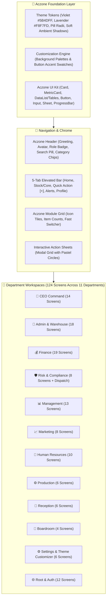

# 📱 Rebma Impex Mobile — Aczone Design System & Architecture Specification (`mobileUI.md`)

This document defines the complete UI/UX overhaul of **Rebma Impex Mobile**, transitioning the visual language and layout architecture to the **Aczone Design System**.

---

## 🗺️ Visual Architecture & Flowchart



---

## 🎨 1. Theme Tokens & Dynamic Customization

### Brand Colors & Accent Matrix
* **Primary Brand:** Royal Violet (`#5B4DFF` → `#6C5CE7` → `#7C3AED`) with soft lavender tinting (`#F8F7FD`).
* **Semantic Pastels Matrix:**
  * 🌿 **Mint / Emerald (`#DCFCE7` / `#10B981`):** Stock Inbound, Success, Active Approvals.
  * 🌊 **Sky / Blue (`#E0F2FE` / `#0284C7`):** Port Cargo, Waybills, In Transit, Dispatch.
  * ⚡ **Amber / Gold (`#FEF3C7` / `#D97706`):** Pending Approvals, Invoices Awaiting Payment, Alerts.
  * 🌸 **Rose / Coral (`#FFE4E6` / `#E11D48`):** Stock Deductions, Discrepancies, Rejected Batches.
  * 🔮 **Lavender / Purple (`#EDE9FE` / `#6366F1`):** Management, Boardroom, Analytics, Settings.

### Dynamic Settings Engine
In **Settings > Display & Appearance (`AppearanceScreen.tsx`)**:
1. **Background Palette Switcher:**
   * **Lavender Soft** (`#F8F7FD` — Aczone Default)
   * **Clean Slate** (`#F1F5F9`)
   * **Warm Linen** (`#FAF9F6`)
   * **Pure Crisp White** (`#FFFFFF`)
   * **Dark Mode** (`#0F172A` / `#1E293B`)
2. **Button & Accent Swatch Switcher:**
   * **Royal Violet** (`#5B4DFF`)
   * **Emerald Green** (`#10B981`)
   * **Ocean Blue** (`#3B82F6`)
   * **Sunset Amber** (`#F59E0B`)
   * **Rose Berry** (`#F43F5E`)
   * **Teal Cyan** (`#14B8A6`)
3. **Typography & Font Scaling:**
   * Scaled across `Small` (90%), `Medium` (100%), and `Large` (115%).

---

## 🧩 2. Component Design Specifications

| Component | Key Aczone Design Specifications |
| :--- | :--- |
| **`Card.tsx`** | Pure white (`#FFFFFF`), `borderRadius: 22`, micro-border (`#EDE9FE`), ambient soft violet drop-shadow (`rgba(91, 77, 255, 0.06)`). |
| **`MetricCard.tsx`** | 2x2 grid layout, `44x44` pastel icon container, bold `type.kpi28` counters, uppercase labels, and touch ripple. |
| **`DataList.tsx` (Tables)** | Aczone Data Card pattern: Leading colored icon tile, bold title + status pill, 2-column key-value spec grid, and context actions. |
| **`Button.tsx`** | Full rounded pill (`borderRadius: 9999` or `16`), gradient fill, white bold label with trailing arrow icon (`→`). |
| **`Input.tsx` & Pickers** | Soft lavender background (`#F8F7FD`), `borderRadius: 16`, subtle border with focused violet glow (`#6C5CE7`). |
| **`ProgressBar.tsx`** | Rounded capsule progress tracks (`8px–12px`), dual-color violet/cyan gradients, and percentage labels. |
| **`Tabs.tsx`** | Horizontal slider of rounded pill chips with solid violet active fill and soft-lavender inactive pills. |
| **`Sheet.tsx` (Modals)** | Smooth animated bottom sheets with rounded grab bar, clean header with `✕` dismiss, and padded action footers. |

---

## 🏢 3. Department Screen Breakdown (124 Screens)

1. **👑 CEO Command (14 Screens):** `OverviewScreen`, `SupplierOrdersScreen`, `TransactionsScreen`, `InvoicesScreen`, `ReceiptsScreen`, `PriceCatalogScreen`, `WalletsScreen`, `AccountsScreen`, `ApprovalsScreen`, `PriceApprovalsScreen`, `TrackingScreen`, `LiveUsersScreen`, `DeptActivityScreen`, `SpreadsheetsScreen`.
2. **🚢 Admin & Warehouse (18 Screens):** `OverviewScreen`, `PortIngestionScreen`, `ApprovedGoodsScreen`, `StockScreen`, `ReleasesScreen`, `OpsHistoryScreen`, `DeliveriesScreen`, `ActiveDeliveriesScreen`, `DriversScreen`, `TrackingScreen`, `ProofOfDeliveryScreen`, `ScannerScreen`, `FleetOverviewScreen`, `FuelManagementScreen`, `MaintenanceScreen`, `FleetAnalyticsScreen`, `OpsAnalyticsScreen`, `SpreadsheetsScreen`.
3. **💰 Finance (19 Screens):** `OverviewScreen`, `OrdersQueueScreen`, `RecordPaymentScreen`, `ReceiptsScreen`, `InvoicesScreen`, `SalesHistoryScreen`, `PriceCatalogScreen`, `WalletsScreen`, `TransactionsScreen`, `CreditMgmtScreen`, `ChequesScreen`, `MobileMoneyScreen`, `PettyCashScreen`, `ExpensesScreen`, `PayrollScreen`, `RecurringPaymentsScreen`, `StatementScreen`, `TaxVATScreen`, `FinReportsScreen`, `SpreadsheetsScreen`.
4. **🛡️ Risk & Compliance (8 Screens + Dispatch):** `RiskOverviewScreen`, `RiskApprovalsScreen`, `CustomerCreditScreen`, `RecruitmentScreen`, `DeptActivityScreen`, `SpreadsheetsScreen`, and dispatch integration screens.
5. **📊 Management (13 Screens):** `MgmtOverviewScreen`, `MgmtApprovalsScreen`, `TransactionsScreen`, `SetPricesScreen`, `InvoicesScreen`, `ReceiptsScreen`, `LedgerScreen`, `PayrollScreen`, `MgmtAnalyticsScreen`, `StockManagementScreen`, `DeptActivityScreen`, `PerformanceAlertsScreen`, `SpreadsheetsScreen`.
6. **📈 Marketing (8 Screens):** `OverviewScreen`, `CreateOrderScreen`, `CustomersScreen`, `PriceCatalogScreen`, `CreditRequestsScreen`, `SalesHistoryScreen`, `AnalyticsScreen`, `SpreadsheetsScreen`.
7. **👥 Human Resources (10 Screens):** `OverviewScreen`, `StaffScreen`, `AttendanceScreen`, `RegistrationsScreen`, `LeaveManagementScreen`, `PayrollScreen`, `DepartmentManagerScreen`, `PerformanceAlertsScreen`, `HrQueriesScreen`, `SpreadsheetsScreen`.
8. **⚙️ Production (6 Screens):** `OverviewScreen`, `InternalOrdersScreen`, `WipStockScreen`, `OutputRecordingScreen`, `AnalyticsScreen`, `SpreadsheetsScreen`.
9. **🏢 Reception (6 Screens):** `VisitorLogScreen`, `VisitorsScreen`, `AttendanceScreen`, `DailyReportsScreen`, `AnalyticsScreen`, `SpreadsheetsScreen`.
10. **🎥 Boardroom (4 Screens):** `VideoConfScreen`, `AnnouncementsScreen`, `DirectMessagesScreen`, `MeetingsScreen`.
11. **⚙️ Settings (6 Screens):** `AppearanceScreen`, `ProfileAccountScreen`, `ChangePasswordScreen`, `TwoFactorScreen`, `ControlCenterScreen`, `DeleteAccountScreen`.
12. **🌐 Root & Auth (12 Screens):** `WelcomeScreen`, `LoginScreen`, `RegisterScreen`, `ProfileScreen`, `NotificationsScreen`, `FeedbackScreen`, `SearchScreen`, `PayslipsScreen`, `MessengerChannelsScreen`, `MessengerThreadScreen`, `DepartmentPlaceholderScreen`, `DesignSystemScreen`.

---

# 🚀 Part 2: Elite Design Evolution (Stripe / Linear / Apple Grouped Hubs)

Following the latest review, the interface moves away from heavy square cards in favor of **State-of-the-Art Grouped Action Hubs**:

```
┌─────────────────────────────────────────────────────────────┐
│  ACCOUNTS & TREASURY                                        │
│ ┌─────────────────────────────────────────────────────────┐ │
│ │ 💳  Orders Queue                     3 Pending Review › │ │
│ │ ─────────────────────────────────────────────────────── │ │
│ │ 💰  Record Payment                       Quick Intake › │ │
│ │ ─────────────────────────────────────────────────────── │ │
│ │ 🧾  Invoices & Receipts                  8 In Register › │ │
│ │ ─────────────────────────────────────────────────────── │ │
│ │ 🏦  Wallets & Accounts                GHS 1.4M Active › │ │
│ └─────────────────────────────────────────────────────────┘ │
└─────────────────────────────────────────────────────────────┘
```

### 1. Grouped Action Hub Architecture (`ModuleLauncher.tsx`)
* **Container:** Single elevated rounded container (`borderRadius: 20`, `borderWidth: 1`, `borderColor: t.colors.border`, pure white `#FFFFFF` in light mode, `#1E293B` in dark mode).
* **Interactive Rows:**
  * **Icon Squircle:** `38x38` pastel background (`borderRadius: 12`) with department action tint (e.g., Sky for Cargo, Emerald for Payments, Amber for Approvals, Violet for Settings).
  * **Title & Subtitle:** Bold `type.body14` title with uppercase `type.label9` category or descriptive subtitle.
  * **Trailing Chevron:** Right arrow chevron (`›`) with optional dynamic status pill (e.g., `3 Pending`, `In Stock`).
  * **Dividers:** Fine hairline separator (`1px solid #F1F0FB` / `#334155`) between items.
  * **Press State:** Tactile opacity and subtle lavender highlight on press.

### 2. Sticky Sheet Modal Engine (`Sheet.tsx`)
* **Header:** Pinned top bar with grab handle, title, optional subtitle/badge, and circular `✕` dismiss button.
* **Scroll Body:** `ScrollView` takes `flex: 1` with `keyboardShouldPersistTaps="handled"` for seamless scrolling of all form inputs.
* **Sticky Footer:** Pinned bottom bar with `SafeAreaView` bottom padding, ensuring the **Primary Submit Button** is **100% visible at all times** regardless of keyboard height or device screen dimensions.

### 3. Header & Navigation Fixes
* **Notification Bell:** Fixed direct routing in `AppHeader.tsx` to `AlertsTab` with real-time unread badge counter.
* **Department Action FAB (`+`):** Smart context-aware launcher tied directly to the active department's primary workflow.
* **Accounts Department Branding:** Updated label to `Accounts Department` in `departmentRegistry.ts` and `screens/finance/OverviewScreen.tsx` while maintaining backend schema compatibility (`FINANCE` code).
* **Sectioned Grouping Across All 11 Departments:** Added structured `sections` to `DEPARTMENT_REGISTRY` for every department (Admin & Warehouse, Reception, Marketing & Sales, Accounts Department, Risk & Compliance, Management, Human Resources, Production, CEO Command, Boardroom, and Settings), ensuring seamless Linear / Stripe-style grouped action hubs across the entire mobile experience.
* **Overview Screens Modernization:** Upgraded all department overview hubs (`Marketing`, `Risk`, `Management`, `HR`, `Production`, `Reception`, `Finance`, `CEO`) with Aczone Hero Cards, 2x2 Metric Grids, Quick Action Tiles, and Linear Grouped Action Hubs.


